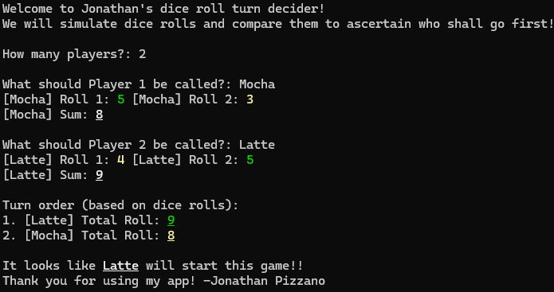

<h1>Welcome to My Dice-Based Turn Decider!</h1>

This is a simple terminal program which, when provided with a player count, will roll die proportional to that count,
accumulate the rolls, and compare sums to create an ordered output of who should go first!
<ul style="list-style-type: circle;">
  <li>The individual rolls are colored from low to high with red, yellow, and green respectively.</li>
  <li>The final sums are also colored similarly but the divisions will be based on the number of players</li>
</ul>

Thank you for stopping by and please feel free to raise any issues or concerns you may experience on here :).
